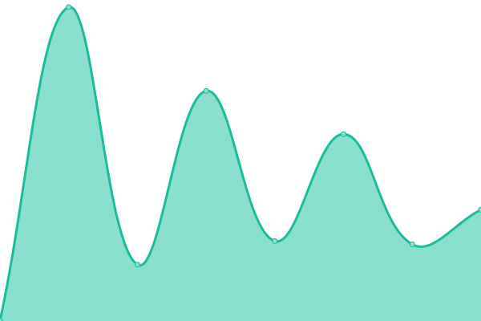

# [📈 Live Status](https://status.playreal.city): <!--live status--> **🟧 Partial outage**

This repository contains the open-source uptime monitor and status page for [聚樂邦](https://status.playreal.city), powered by [Upptime](https://github.com/upptime/upptime).

With [Upptime](https://upptime.js.org), you can get your own unlimited and free uptime monitor and status page, powered entirely by a GitHub repository. We use [Issues](https://github.com/clubon/status.playreal.city/issues) as incident reports, [Actions](https://github.com/clubon/status.playreal.city/actions) as uptime monitors, and [Pages](https://status.playreal.city) for the status page.

<!--start: status pages-->
<!-- This summary is generated by Upptime (https://github.com/upptime/upptime) -->
<!-- Do not edit this manually, your changes will be overwritten -->
<!-- prettier-ignore -->
| URL | Status | History | Response Time | Uptime |
| --- | ------ | ------- | ------------- | ------ |
|  [clubon.space](https://www.clubon.space/robots.txt) | 🟩 Up | [clubon-space.yml](https://github.com/clubon/status.playreal.city/commits/HEAD/history/clubon-space.yml) | 

 836ms
     
 | 

<a href="https://status.playreal.city/history/clubon-space">100.00%</a>
    

|  [playreal.com.tw](https://playreal.com.tw/icont.ico) | 🟥 Down | [playreal-com-tw.yml](https://github.com/clubon/status.playreal.city/commits/HEAD/history/playreal-com-tw.yml) | 

 372ms
     
 | 

<a href="https://status.playreal.city/history/playreal-com-tw">0.00%</a>
    

|  [craft.playreal.city](https://craft.playreal.city/bonbon.png) | 🟩 Up | [craft-playreal-city.yml](https://github.com/clubon/status.playreal.city/commits/HEAD/history/craft-playreal-city.yml) | 

 366ms
     
 | 

<a href="https://status.playreal.city/history/craft-playreal-city">100.00%</a>
    

|  [go.playreal.city](https://go.playreal.city/bonbon.png) | 🟩 Up | [go-playreal-city.yml](https://github.com/clubon/status.playreal.city/commits/HEAD/history/go-playreal-city.yml) | 

 315ms
     
 | 

<a href="https://status.playreal.city/history/go-playreal-city">100.00%</a>
    

<!--end: status pages-->

[**Visit our status website →**](https://status.playreal.city)

## 📄 License

- Powered by: [Upptime](https://github.com/upptime/upptime)
- Code: [MIT](./LICENSE) © [聚樂邦](https://status.playreal.city)
- Data in the `./history` directory: [Open Database License](https://opendatacommons.org/licenses/odbl/1-0/)
